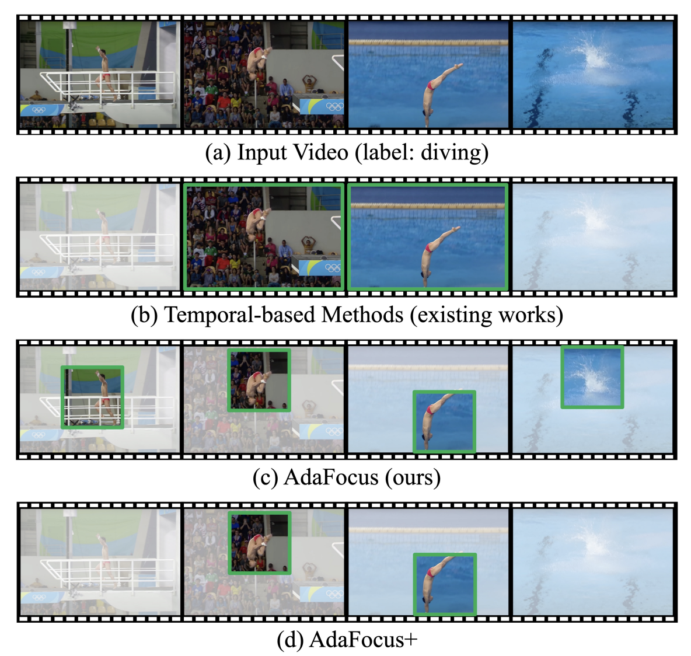
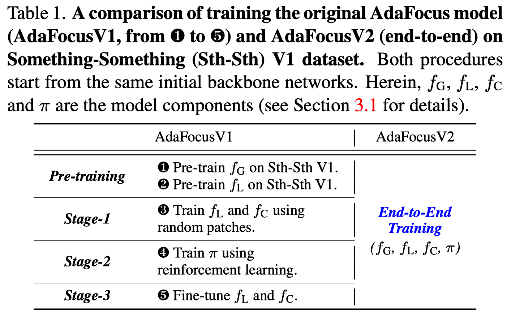
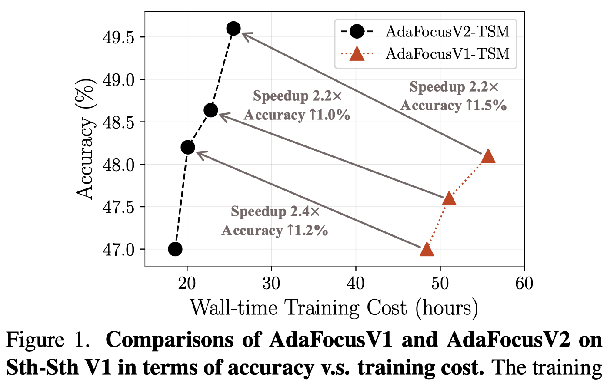
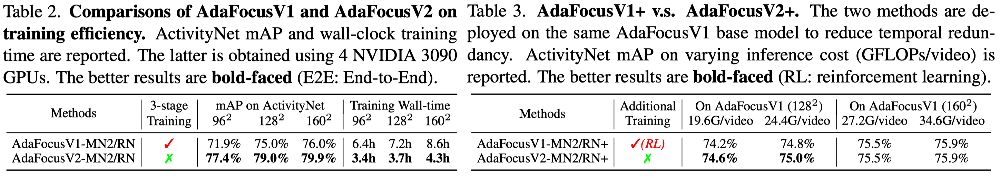
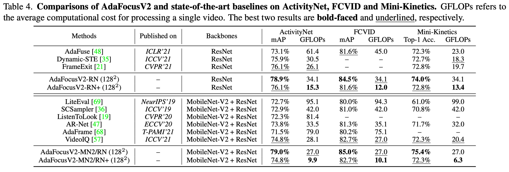
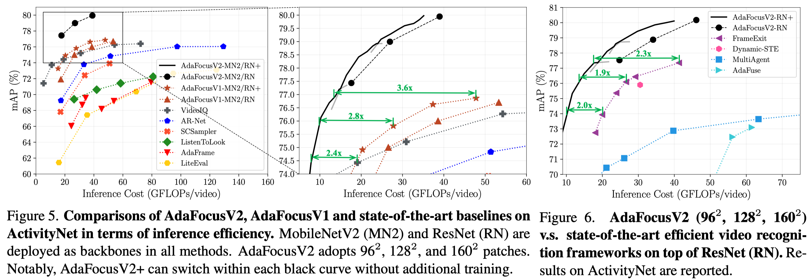
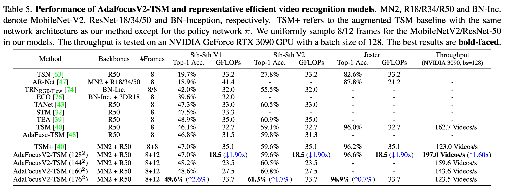
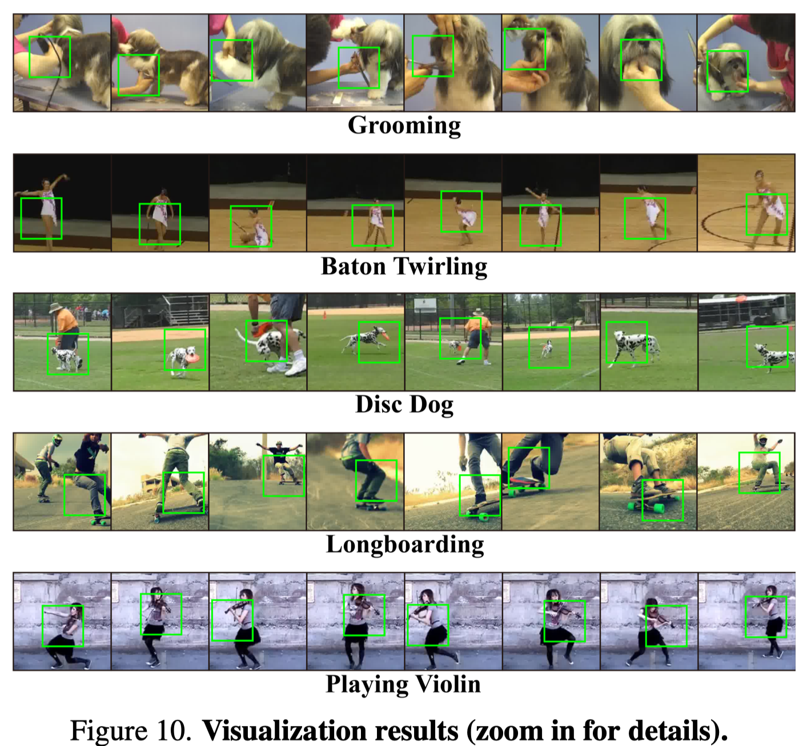

# AdaFocusV2 (CVPR-2022)

This repo contains the official code and pre-trained models for AdaFocusV2.

- [AdaFocus V2: End-to-End Training of Spatial Dynamic Networks for Video Recognition](https://arxiv.org/abs/2112.14238)


**Update: The latest version of the AdaFocus series, [Uni-AdaFocus (TPAMI'24)](https://github.com/LeapLabTHU/Uni-AdaFocus) has been released!** This repository is no longer maintained.

<br>


<p align="left">
    
    
</p>

## Reference
If you find our code or paper useful for your research, please cite:
```
@InProceedings{wang2021adafocus,
    author = {Wang, Yulin and Chen, Zhaoxi and Jiang, Haojun and Song, Shiji and Han, Yizeng and Huang, Gao},
     title = {Adaptive Focus for Efficient Video Recognition},
 booktitle = {Proceedings of the IEEE/CVF International Conference on Computer Vision (ICCV)},
     month = {October},
      year = {2021}
}

@InProceedings{wang2022adafocusv2,
    author = {Wang, Yulin and Yue, Yang and Lin, Yuanze and Jiang, Haojun and Lai, Zihang and Kulikov, Victor and Orlov, Nikita and Shi, Humphrey and Huang, Gao},
     title = {AdaFocus V2: End-to-End Training of Spatial Dynamic Networks for Video Recognition},
 booktitle = {Proceedings of the IEEE/CVF Conference on Computer Vision and Pattern Recognition (CVPR)},
      year = {2022}
}
```


## Introduction

Recent works have shown that the computational efficiency of video recognition can be significantly improved by reducing the spatial redundancy. As a representative work, the adaptive focus method (AdaFocus) has achieved a favorable trade-off between accuracy and inference speed by dynamically identifying and attending to the informative regions in each video frame. However, AdaFocus requires a complicated three-stage training pipeline (involving reinforcement learning), leading to slow convergence and is unfriendly to practitioners. This work reformulates the training of AdaFocus as a simple one-stage algorithm by introducing a differentiable interpolation-based patch selection operation, enabling efficient end-to-end optimization. We further present an improved training scheme to address the issues introduced by the one-stage formulation, including the lack of supervision, input diversity and training stability. Moreover, a conditional-exit technique is proposed to perform temporal adaptive computation on top of AdaFocus without additional training. Extensive experiments on six benchmark datasets (i.e., ActivityNet, FCVID, Mini-Kinetics, Something-Something V1&V2, and Jester) demonstrate that our model significantly outperforms the original AdaFocus and other competitive baselines, while being considerably more simple and efficient to train.

<p align="center">
    
</p>


## Results


- Compared with AdaFocusV1

<p align="center">
    
    
</p>


<p align="center">
    
</p>


- ActivityNet, FCVID and Mini-Kinetics

<p align="center">
    
</p>

<p align="center">
    
</p>


- Something-Something V1&V2 and Jester

<p align="center">
    
</p>


- Visualization

<p align="center">
    
</p>

## Get Started

Please go to the folder [Experiments on ActivityNet, FCVID and Mini-Kinetics](Experiments%20on%20ActivityNet,%20FCVID%20and%20Mini-Kinetics/) and [Experiments on Sth-Sth and Jester](Experiments%20on%20Sth-Sth%20and%20Jester) for specific docs.


## Contact
If you have any question, feel free to contact the authors or raise an issue. 
Yulin Wang: wang-yl19@mails.tsinghua.edu.cn.
